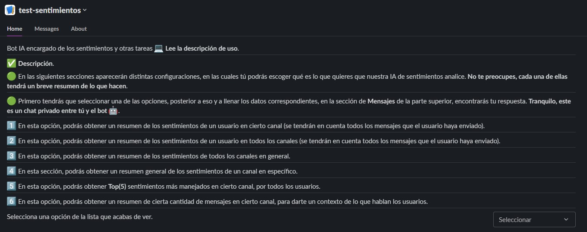
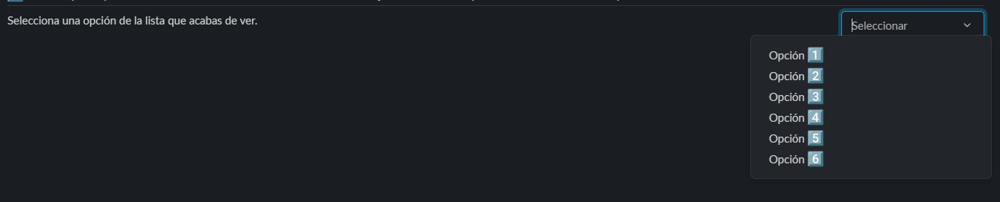
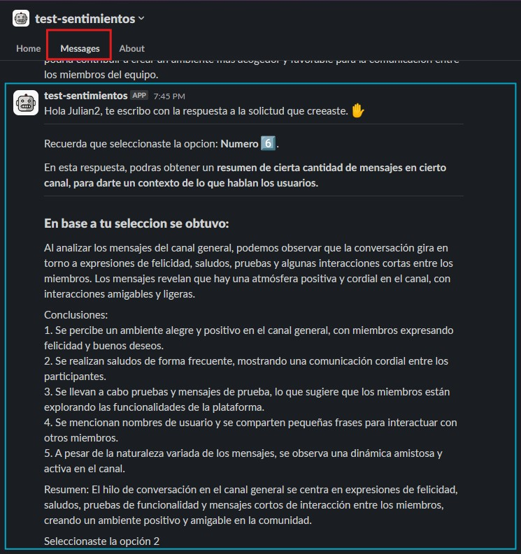
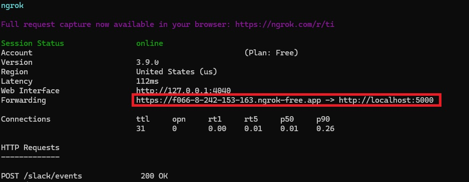
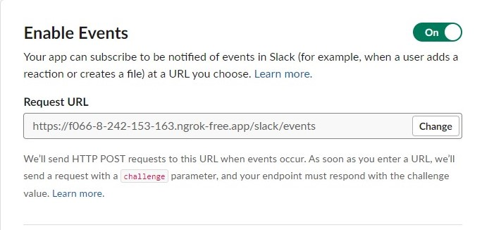

# Ai_Project FeelsFocus

Let's delve into the features that set FeelsFocus apart:
- Sentiment Analysis: Our machine learning model parses through conversations to extract emotions, delivering concise summaries for easy interpretation.
- Structured Responses: Seamlessly integrate with language models (LLMs) to provide 
- Structured responses, ensuring clarity and coherence in every interaction.
- Intuitive UI Integration: With a user-friendly interface, navigating FeelsFocus is a breeze, making it accessible and self-explanatory for users of all levels.
- ChatGPT Integration: Engage in inline conversations without ever leaving Slack, thanks to our seamless integration with ChatGPT.
- Community-Centric Approach: Designed with communities in mind, FeelsFocus facilitates effective communication and fosters a culture of collaboration.


## Tech Stack

**Client:** Block kit builder,slackbolt

**Server:** Flask, AWS (EC2), Ngrok,


## Our bot app will give you different options, which you will see in the bot interface:

1️⃣ En esta opción, podras obtener un resumen de los sentimientos de un usuario en cierto canal **se tendran en cuenta todos los mensajes que el usuario haya enviado**

2️⃣ En esta opción, podras obtener un resumen de los sentimientos de un usuario en todos los canales **se tendran en cuenta todos los mensajes que el usuario haya enviado**.

3️⃣  En esta opción, podras obtener un **resumen de los sentimientos de todos los canales en general**.

4️⃣ En esta seccion, podras obtener un **resumen general de los sentimientos de un canal en especifico**.

5️⃣ En esta opción, podrás obtener **Top(5) sentimientos más manejados en cierto canal, por todos los usuarios.**

6️⃣  En esta opción, podrás obtener un **resumen de cierta cantidad de mensajes en cierto canal, para darte un contexto de lo que hablan los usuarios.**


## Lessons Learned

What did you learn while building this project? What challenges did you face and how did you overcome them?


## Deployment or installation

To make an installation of the application in your workspace, you should put this command on the web, which redirects you to slack and accept the application permissions

```bash
  http://ec2-18-118-107-108.us-east-2.compute.amazonaws.com/slack/install
```


## How to use:

- Install the application in your workspace.
- Add the bot to each of the channels.
- The messages will be stored, but first you will have to send a message in a chat to start saving them.
- After you have an acceptable amount of messages, more than 50, you can test the application in a better way.
- Go to the applications section and you will see the following interface.

- Select one of the available options.
- Fill in the corresponding data for that option.

- The bot will start a conversation with the user with a message in this section (this message will be only between you and the bot, there is no third party):



## Environment Variables

To run this project, you will need to add the following environment variables to your .env file

`SLACK_TOKEN`

`SLACK_SIGNING_SECRET`

`OPENAI_API_KEY`


## if you want to make code changes and test the changes locally, you need to:

- 
- Install ngrok  [Ngrok](https://ngrok.com/download)
- Run it on a port, slack recommends port 5000
```bash
  ngrok http 5000
```

- Run the app.py file
```bash
  app.py
```
- In the slack configuration change the addresses to the one that ngrok gives you.



- You can now make your changes on your local computer.


